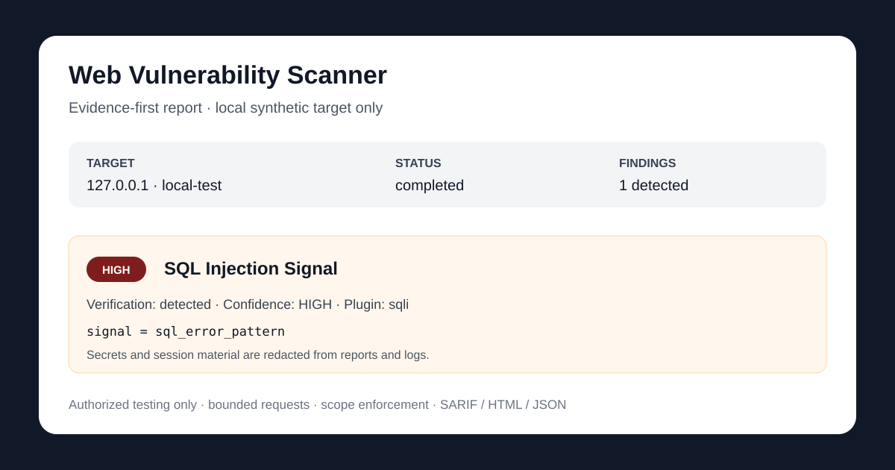

# Web Vulnerability Scanner

Evidence-first command-line scanner for **authorized** web security testing.



The scanner is designed around bounded requests, explicit scope controls, reproducible evidence, and conservative verification labels. CI security targets are local/synthetic only; the project does not ship mass-exploitation workflows or unsafe defaults.

## Highlights

- HTTP crawler with scope/SSRF guards and bounded per-host concurrency.
- Optional Playwright-assisted discovery and authenticated browser flows.
- Passive web posture checks: security headers, cookies, CORS, redirects, and verbose errors.
- Bounded exposure checks for common backup/debug/config paths.
- Swagger/OpenAPI and GraphQL discovery.
- DNS and TLS inventory.
- Stable active checks for SQLi and auth-aware business-logic/access-control behavior.
- Actor sessions, RBAC verification, replay artifacts, and workflow scenarios for authorized test accounts.
- JSON and HTML reports plus SARIF 2.1.0 conversion.
- Plugin execution contracts for request budgets, per-surface deadlines, testcase validation, and evidence schema validation.
- Local intentionally vulnerable regression corpus for false-positive/false-negative, auth, cookie, scope, rate-limit, and concurrency QA.
- Wheel/sdist, Docker, clean-install, checksum, and release validation in GitHub Actions.

## Authorization and Safety

Use this project only on systems you own or have explicit permission to test.

The default configuration is intentionally bounded. Experimental plugins remain disabled by the registry even when configuration attempts to enable them. No scan profile promotes them automatically. Authentication checks require credentials supplied explicitly by the operator.

CI never scans public targets. Regression and benchmark jobs use only the bundled localhost synthetic corpus.

## Installation

Create a virtual environment:

```bash
python -m venv .venv
```

Windows:

```bash
.\.venv\Scripts\activate
```

macOS / Linux:

```bash
source .venv/bin/activate
```

Install the project:

```bash
python -m pip install --upgrade pip
python -m pip install -e .
```

Development dependencies:

```bash
python -m pip install -e .[dev]
```

Browser-assisted scanning:

```bash
python -m pip install -e .[browser]
playwright install chromium
```

The legacy `requirements.txt` workflow remains available for compatibility.

## Quick Local Check

The bundled smoke target exercises the scanner without contacting a third-party system:

```bash
python smoke/run_smoke.py
```

The dedicated regression corpus is exercised by pytest and CI:

```bash
python -m pytest -q tests/test_security_regression.py tests/test_reporting_qa.py tests/test_concurrency.py
```

## Run a Scan

Installed CLI:

```bash
web-vuln-scanner https://target.tld --config config/default_config.yaml --output reports
```

Direct Python entry point:

```bash
python main_v2.py scan https://target.tld --config config/default_config.yaml --output reports
```

With API discovery:

```bash
web-vuln-scanner https://target.tld \
  --config config/default_config.yaml \
  --swagger https://target.tld/openapi.json \
  --graphql https://target.tld/graphql \
  --output reports
```

`main.py` is retained only as a deprecated compatibility shim. New integrations should use `web-vuln-scanner` or `main_v2.py`.

## Scan Profiles

Profiles are materialized into normal YAML so there is one auditable configuration contract.

Passive posture assessment:

```bash
web-vuln-profile passive --config config/default_config.yaml --output config/passive.generated.yaml
web-vuln-scanner https://target.tld --config config/passive.generated.yaml --output reports
```

Bounded active assessment:

```bash
web-vuln-profile safe-active --config config/default_config.yaml --output config/safe-active.generated.yaml
```

Authorized browser-capable baseline:

```bash
web-vuln-profile full-authorized --config config/default_config.yaml --output config/full-authorized.generated.yaml
```

Available profiles:

- `passive` — crawler plus passive/posture layers; active plugins disabled.
- `safe-active` — stable bounded SQLi and business-logic checks; experimental plugins stay disabled.
- `full-authorized` — browser-capable authorized baseline with stable plugins; credentials/workflows still require explicit configuration.

## Plugin Contract

Active plugins use the shared `RequestManager`; plugins must not create ad-hoc HTTP clients.

Each plugin is constrained per attack surface by:

- `max_tests_per_surface` — caps generated testcases;
- `request_budget` — caps active plugin requests;
- `timeout_seconds` — cooperative per-surface execution deadline;
- testcase validation — plugin name, surface id, input kind, parameter, and payload are checked before dispatch;
- evidence validation — reportable results must provide the `webvulnscanner/evidence-v1` contract, evidence, and reproduction metadata.

A contract violation is recorded as an execution error and does not become a finding.

## Plugin Maturity

| Plugin | Maturity | Default | Promotion status |
| --- | --- | --- | --- |
| `sqli` | stable | enabled | local positive/negative regression covered |
| `business_logic` | stable | enabled | auth/RBAC verification path retained |
| `xss_reflected` | experimental | disabled | blocked pending dedicated quality proof |
| `lfi` | experimental | disabled | blocked pending dedicated quality proof |
| `cmd_injection` | experimental | disabled | blocked pending dedicated quality proof |
| `open_redirect` | experimental | disabled | blocked pending dedicated quality proof |

Experimental code is not promoted merely because an implementation exists. Promotion requires dedicated local positive/negative fixtures, false-positive review, scope/budget compliance, evidence quality, and regression coverage.

## Reports

A scan produces:

- `scan_report.json` — machine-readable report;
- `scan_report.html` — human-readable evidence report.

Convert JSON to SARIF 2.1.0:

```bash
web-vuln-sarif reports/scan_report.json --output reports/scan_report.sarif
```

Committed sanitized examples:

- [`docs/example-report.json`](docs/example-report.json)
- [`docs/example-report.html`](docs/example-report.html)

Report QA covers JSON structure, HTML URL handling, sensitive-key redaction, and SARIF conversion. Authentication material should never be committed to fixtures or example reports.

## Security Regression Corpus

`tests/local_corpus.py` starts a localhost `ThreadingHTTPServer` with intentionally synthetic behavior used only by automated tests. It includes:

- known SQL-error positive signal;
- constant safe endpoint for false-positive regression;
- cookie-authenticated user/admin endpoints;
- bounded 429 + `Retry-After` behavior;
- reserved synthetic endpoints for experimental plugins that remain disabled.

The corpus is not a deployable vulnerable application and is not used against remote hosts.

## Performance and Rate Limits

Deterministic tests verify `per_host_concurrency` is never exceeded. The local benchmark runs:

```bash
python scripts/benchmark_local.py
```

It writes `benchmark_out/local-performance.json` with local-only throughput and latency (mean/p50/p95/max). CI logs this result for each change without treating runner-specific numbers as universal performance claims.

## Exit Codes

- `0` — no reportable findings.
- `1` — findings were produced.
- `2` — runtime or configuration failure.
- `3` — partial or aborted run.

## Tests

Full suite:

```bash
python -m pytest -q
```

Critical static checks:

```bash
ruff check . --select E9,F63,F7,F82
python -m compileall -q core layers plugins workflows smoke scripts tests main_v2.py
```

GitHub Actions additionally validates the localhost smoke corpus, report-to-SARIF conversion, clean wheel installation, Docker CLI startup, and local performance/concurrency behavior.

## Packaging and Releases

Build Python artifacts locally:

```bash
python -m pip install build twine
python -m build
python -m twine check dist/*
```

Docker:

```bash
docker build -t web-vuln-scanner .
docker run --rm web-vuln-scanner --help
```

The release workflow creates wheel/sdist artifacts and SHA256 checksums for `v*` tags. PyPI publishing is opt-in only through the `pypi` GitHub environment and Trusted Publishing; it is not enabled by default.

## Repository Metadata

The project is licensed under Apache-2.0. Canonical description/topics and the social-preview candidate are tracked in [`.github/repository-metadata.yml`](.github/repository-metadata.yml) so repository settings can be reviewed in code.

## Contributing

See [`CONTRIBUTING.md`](CONTRIBUTING.md). New checks must be bounded, scope-aware, evidence-driven, false-positive conscious, and covered by local/synthetic fixtures. CI changes must not introduce remote scanning targets.

For project security policy and responsible-use boundaries, see [`SECURITY.md`](SECURITY.md).
